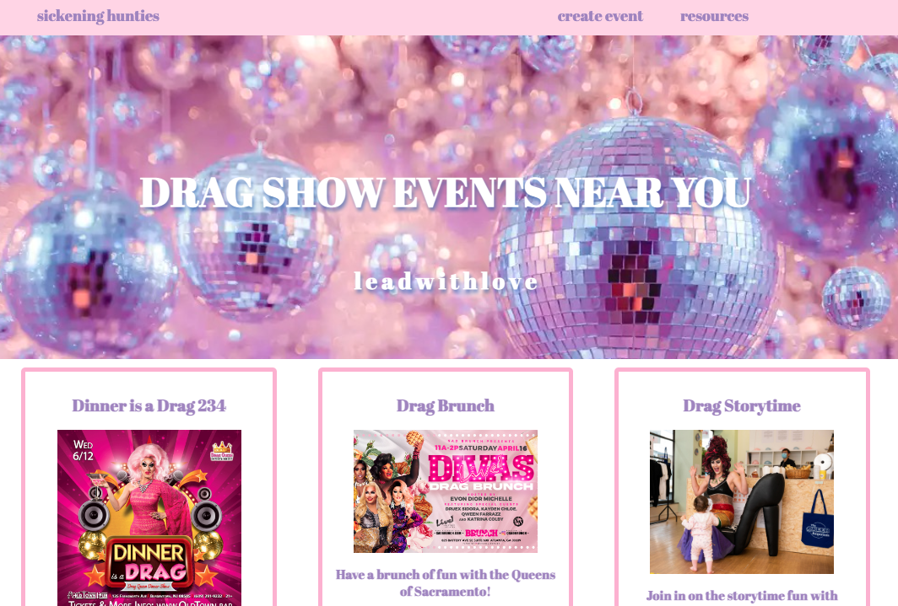
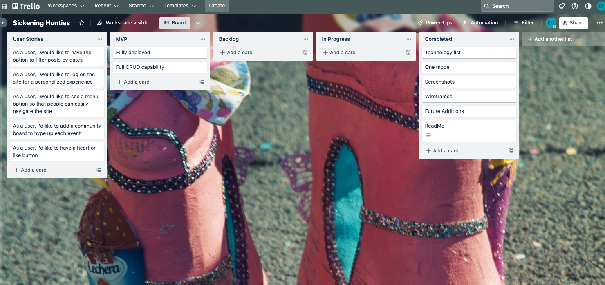
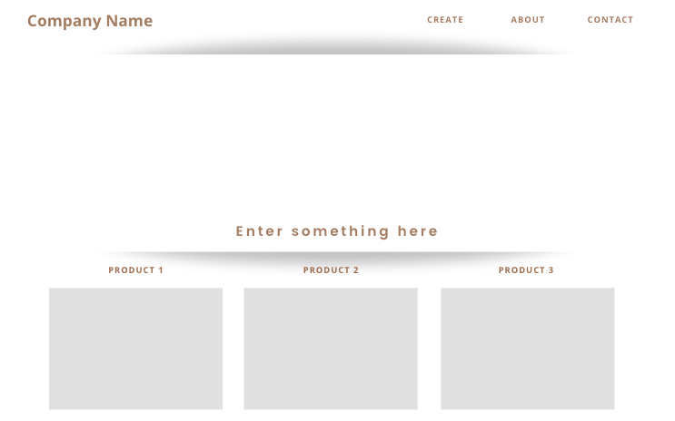
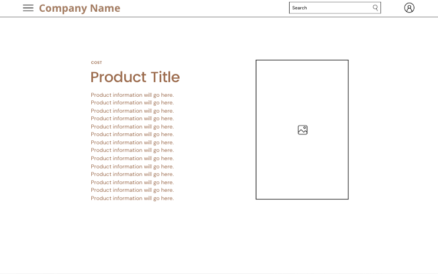

# Sickening Hunties

### Sickening Hunties is a full CRUD events application for all things drag! 

#### 
#### 

---

### Technologies Used:
#### 1. Ruby on Rails
#### 2. React
#### 3. Postgresql
#### 4. VS. CODE
#### 5. Trello

---

### Links
Feel free to [click here to view the live site](https://steady-sunburst-26c1a0.netlify.app/). You can view additional links below:

#### [Trello BOARD](https://trello.com/b/HsiSEePZ/sickening-hunties)
#### [Github Frontend](https://github.com/ellzmarie/sickening-rails-react-frontend)
#### [Github Backend](https://github.com/ellzmarie/sickening-rails-react-backend)
#### [Rails Backend](https://sickening-rails-react-backend.onrender.com/events)

#### 
---

### Wireframes 
#### 
#### 

---

### ERD Diagram 

**Drag Show Events**

<table>
  <th colspan="2" style="text-align:center">Artist</th>
  <tr>
    <td>id</td>
    <td>primary key</td>
  </tr>
  <tr>
    <td>event_title</td>
    <td>string</td>
  </tr>
  <tr>
    <td>image</td>
    <td>string</td>
  </tr>
  <tr>
    <td>description</td>
    <td>string</td>
</table>

---

### Future Enhancements: 
#### 1. Ability to filter posts by locations, dates and specific events.
#### 2. Add authentication. 
#### 3. An expanded Menu option to find specific drags in each city/state.
#### 4. Build a safe space for the LGBTQ+ community to connect and communicate with one another.
#### 5. Have a heart or like button and comment section for each event.